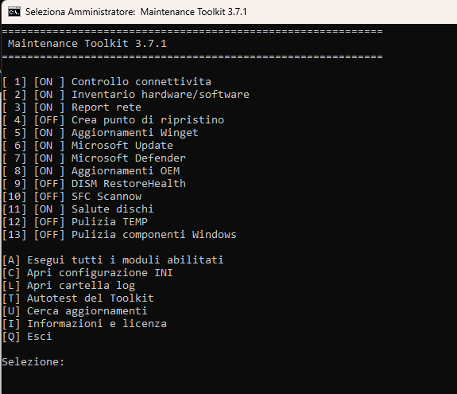
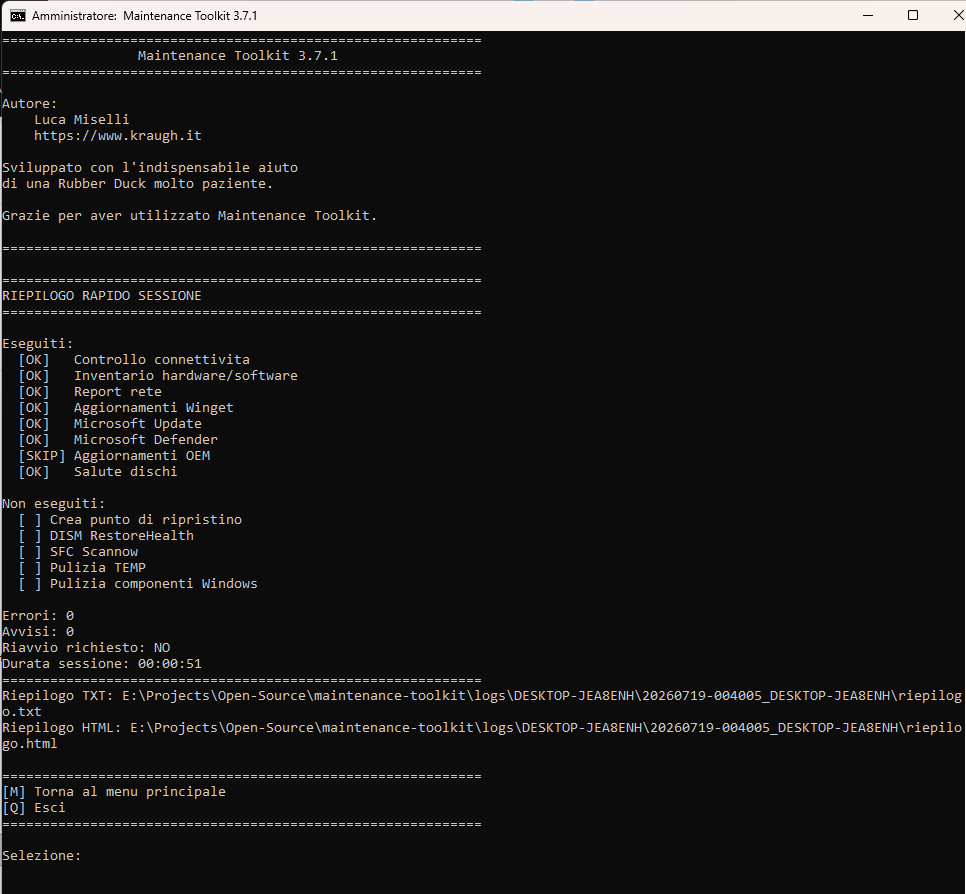
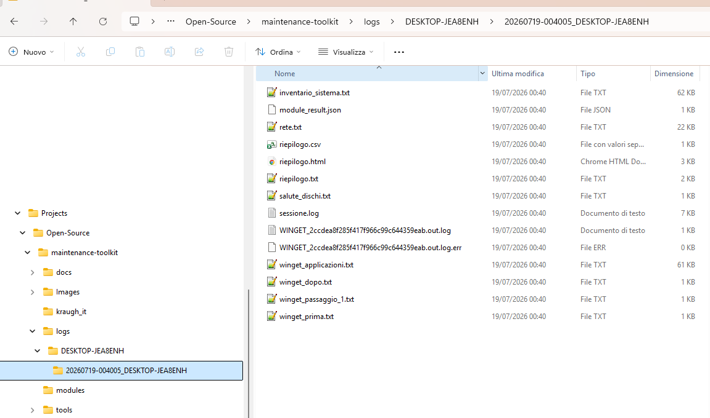

# Manuale Tecnico

**Versione documento:** 1.0

**Compatibile con:** Maintenance Toolkit 3.7.2-rc.6

**Ultimo aggiornamento:** 18/07/2026

---

## Indice

1. Introduzione
2. Requisiti
3. Installazione
4. Primo utilizzo
5. Esecuzione dei moduli
6. Interpretazione del riepilogo finale
7. Dove trovare i log
8. Risoluzione dei problemi
9. Domande frequenti

---

## Introduzione

Maintenance Toolkit è uno strumento sviluppato per automatizzare le principali attività di manutenzione, diagnostica e verifica dei sistemi Microsoft Windows.

È stato progettato per essere utilizzato sia da tecnici di campo sia da amministratori di sistema, riducendo il tempo necessario per eseguire operazioni ripetitive e garantendo una procedura standardizzata.

Il Toolkit è composto da moduli indipendenti: ciascuna funzionalità può essere eseguita singolarmente oppure all'interno di una manutenzione completa.

Al termine di ogni esecuzione viene generata automaticamente una cartella contenente i log dell'intervento, utile sia per documentare le attività svolte sia per analizzare eventuali anomalie.

L'obiettivo del progetto non è sostituire l'esperienza del tecnico, ma fornire uno strumento affidabile che riduca le operazioni manuali e renda ogni intervento più rapido, ripetibile e documentabile.

---

## Requisiti

Prima di eseguire Maintenance Toolkit verificare che:

- il computer sia acceso e correttamente funzionante;
- l'utente disponga dei privilegi di Amministratore;
- il sistema non stia eseguendo aggiornamenti di Windows;
- sia disponibile una connessione Internet se si desidera utilizzare i moduli che richiedono l'accesso alla rete;
- eventuali software di sicurezza non impediscano l'esecuzione degli script PowerShell.

Per ottenere il massimo beneficio dal Toolkit è consigliabile chiudere le applicazioni non necessarie prima di avviare la manutenzione.

---

## Installazione

Maintenance Toolkit non richiede una procedura di installazione.

Per utilizzarlo è sufficiente:

1. scaricare l'ultima versione del Toolkit;
2. estrarre l'intero contenuto dell'archivio ZIP in una cartella locale, su una chiavetta USB oppure in una cartella condivisa di rete;
3. eseguire `Avvia_Manutenzione.bat`.

> **Attenzione**
>
> Non eseguire i singoli script PowerShell contenuti nella cartella `modules`.
>
> Il launcher `Avvia_Manutenzione.bat` esegue automaticamente tutti i controlli preliminari necessari e avvia il Toolkit con i privilegi richiesti.

> **Suggerimento**
>
> Se utilizzi frequentemente Maintenance Toolkit, conserva una copia aggiornata su una chiavetta USB oppure su una cartella di rete condivisa. Grazie alla gestione separata dei log per ogni computer, è possibile utilizzare la stessa copia del Toolkit su più postazioni senza mescolare i risultati.

---

## Primo utilizzo

Al primo avvio Maintenance Toolkit presenta un menu interattivo contenente tutti i moduli disponibili.



*Figura 1 - Menu principale del Toolkit 3.7.2-rc.6.*

Ogni modulo è identificato da un numero progressivo.

Per eseguire un singolo controllo è sufficiente digitare il numero corrispondente e premere **INVIO**.

È possibile selezionare più moduli contemporaneamente separando i numeri con una virgola oppure con uno spazio, in base alle indicazioni mostrate nel menu.

Per eseguire una manutenzione completa utilizzare l'opzione **A**, che avvia tutti i moduli attualmente abilitati.

Durante l'esecuzione il Toolkit mostra l'avanzamento delle operazioni e informa il tecnico quando un controllo richiede più tempo del previsto, come nel caso di DISM o SFC.

Al termine dell'esecuzione viene visualizzato un riepilogo ed è possibile scegliere se:

- tornare al menu principale;
- eseguire altri moduli;
- uscire dal programma.

> **Suggerimento**
>
> Se non si conosce ancora il Toolkit, è consigliabile iniziare eseguendo pochi moduli alla volta. Dopo aver acquisito familiarità con il funzionamento sarà possibile utilizzare la manutenzione completa.

---

## Esecuzione dei moduli

Maintenance Toolkit permette di eseguire uno o più moduli in base alle esigenze dell'intervento.

Per una verifica rapida è possibile eseguire un singolo controllo, mentre per un'analisi completa è disponibile l'esecuzione di tutti i moduli abilitati.

Durante l'elaborazione il Toolkit informa costantemente il tecnico sullo stato delle operazioni. Alcuni controlli, come Microsoft Update, DISM RestoreHealth, SFC Scannow o gli aggiornamenti OEM, possono richiedere diversi minuti.

Durante gli aggiornamenti Winget il Toolkit può restare apparentemente fermo mentre gli installer lavorano. Sui computer non aggiornati da tempo l'operazione può durare diversi minuti e possono comparire finestre dei singoli programmi: è un comportamento normale.

Quando un'operazione è particolarmente lunga vengono mostrati messaggi di avanzamento, evitando che il computer sembri bloccato.

> **Nota**
>
> La durata della manutenzione dipende dalle prestazioni del computer, dal numero di aggiornamenti disponibili e dall'eventuale presenza di errori del sistema operativo.

Al termine di ogni modulo il risultato viene registrato automaticamente nei log della sessione.

Se un modulo genera un errore, il Toolkit prosegue con quelli successivi quando possibile, permettendo al tecnico di raccogliere comunque il maggior numero di informazioni sullo stato del sistema.

---

## Interpretazione del riepilogo finale

Al termine dell'esecuzione Maintenance Toolkit genera un riepilogo delle operazioni effettuate.

Lo scopo del riepilogo non è sostituire i log dettagliati, ma fornire al tecnico una visione immediata dello stato generale del computer e dell'intervento eseguito.

Il riepilogo indica:

- i moduli eseguiti;
- i moduli non eseguiti;
- gli eventuali errori rilevati;
- il percorso della cartella contenente i log della sessione.



*Figura 2 - Riepilogo finale del Toolkit 3.7.2-rc.6.*

> **Nota**
>
> La presenza di uno o più errori nel riepilogo non significa necessariamente che il computer presenti un guasto. Alcuni moduli possono segnalare anomalie dovute a configurazioni particolari, limitazioni dei privilegi o servizi temporaneamente non disponibili.

Per un'analisi approfondita è sempre consigliabile consultare i file di log generati durante la sessione.

> **Suggerimento**
>
> Prima di consegnare il computer al cliente, dedicare qualche secondo alla lettura del riepilogo finale consente di individuare rapidamente eventuali controlli che meritano un approfondimento.

---

## Dove trovare i log

Al termine di ogni esecuzione Maintenance Toolkit crea automaticamente una nuova cartella dedicata alla sessione corrente.

I log sono organizzati per computer e per data, così da mantenere separati gli interventi effettuati su macchine diverse.

La struttura è simile alla seguente:

```text
logs/
└── NOME-PC/
    ├── aggiornamenti_script.log
    ├── errori_script.log
    └── YYYYMMDD-HHMMSS_NOME-PC/
        ├── sessione.log
        ├── riepilogo.txt
        ├── riepilogo.csv
        ├── riepilogo.html
        └── ...
```

Ogni nuova esecuzione genera una cartella dedicata, rendendo semplice consultare anche interventi effettuati in passato.



*Figura 3 - Struttura dei logs del Toolkit.*

I file più importanti sono:

- **sessione.log** – contiene l'intera esecuzione del Toolkit;
- **riepilogo.txt** – riepilogo rapido leggibile con qualsiasi editor di testo;
- **riepilogo.csv** – dati facilmente importabili in Excel o altri fogli elettronici;
- **riepilogo.html** – report formattato per la consultazione tramite browser.

> **Suggerimento**
>
> In caso di richiesta di assistenza, allegare sempre l'intera cartella della sessione anziché il solo file di riepilogo. In questo modo sarà possibile ricostruire con precisione tutte le operazioni eseguite dal Toolkit.

---

## Risoluzione dei problemi

Di seguito sono riportate le situazioni più comuni che possono impedire il corretto funzionamento di Maintenance Toolkit.

### Il Toolkit non si avvia

Verificare di avere estratto completamente il contenuto dell'archivio ZIP e di eseguire `Avvia_Manutenzione.bat`.

Non avviare direttamente `app/MaintenanceToolkit.ps1` né gli script presenti nella cartella `modules`.

---

### Windows blocca l'esecuzione dello script

Verificare che PowerShell possa eseguire script locali e che eventuali software di sicurezza non ne impediscano l'avvio.

Se necessario, eseguire il Toolkit con privilegi di Amministratore.

---

### Un modulo termina con errore

La presenza di un errore non comporta necessariamente l'interruzione dell'intera manutenzione.

Consultare il riepilogo finale e i file di log della sessione per individuare il modulo che ha generato l'anomalia e la relativa descrizione.

---

### La manutenzione richiede molto tempo

Alcuni moduli, come Microsoft Update, DISM RestoreHealth e SFC Scannow, possono richiedere diversi minuti.

Durante queste operazioni il Toolkit continua a mostrare messaggi di avanzamento. Attendere il completamento prima di interrompere l'esecuzione.

---

### Richiesta di assistenza

Prima di richiedere assistenza verificare di utilizzare l'ultima versione disponibile del Toolkit.

Se il problema persiste, allegare l'intera cartella dei log della sessione e descrivere brevemente il comportamento riscontrato.

Le informazioni di contatto aggiornate sono sempre disponibili sul sito ufficiale del progetto.

---

## Domande frequenti

### Posso eseguire il Toolkit da una chiavetta USB?

Sì. Maintenance Toolkit non richiede installazione e può essere eseguito direttamente da una chiavetta USB o da una cartella condivisa.

---

### Posso utilizzare il Toolkit senza connessione Internet?

Sì.

I moduli che non richiedono accesso alla rete continuano a funzionare normalmente. Alcune funzionalità, come Microsoft Update o Winget, richiedono invece una connessione Internet.

---

### Posso interrompere la manutenzione in qualsiasi momento?

È possibile interrompere l'esecuzione, ma è consigliabile attendere il completamento del modulo in corso per evitare risultati incompleti nei log.

---

### I log contengono dati personali?

I log contengono esclusivamente informazioni tecniche utili alla diagnosi del sistema e alla documentazione dell'intervento.

Prima di condividere i log con terzi è comunque consigliabile verificarne il contenuto.

---

### Come posso verificare se è disponibile una versione più recente?

Utilizzare la funzione **Cerca aggiornamenti**, se disponibile nella versione installata, oppure consultare il sito ufficiale del progetto.

---

### Dove posso trovare documentazione aggiornata?

La documentazione, le nuove versioni e le informazioni sul progetto sono disponibili sul sito ufficiale di Kraugh e sul repository GitHub del progetto.